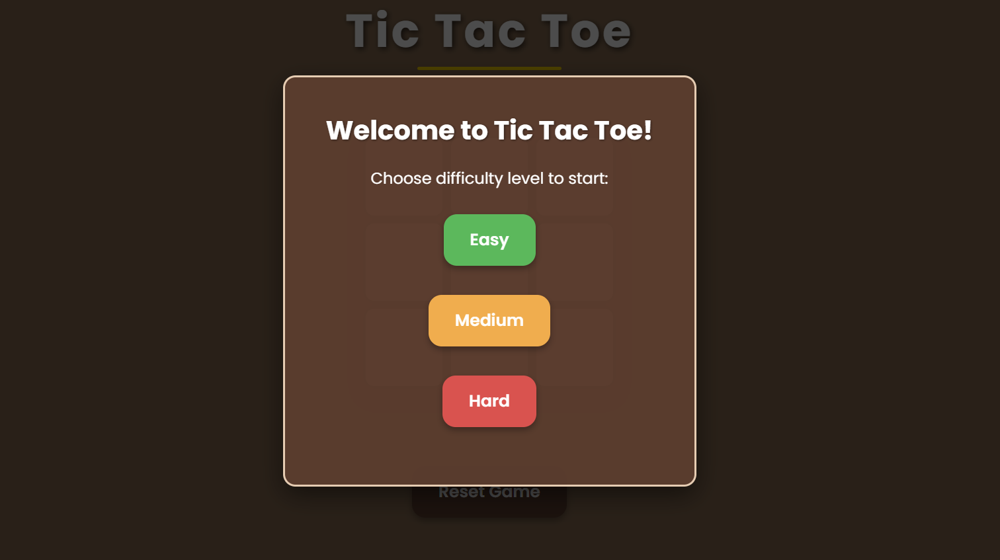

# ticTacToe-withDifficultyLevels

# Tic Tac Toe Game

A modern, responsive Tic Tac Toe game with three difficulty levels using MiniMax algorithm. Bet you cant win against the hard difficulty

## Features

- 💻 Clean, responsive design
- 🎮 Three AI difficulty levels:
  - **Easy**: Random moves
  - **Medium**: Strategic but beatable AI
  - **Hard**: Unbeatable AI using Minimax algorithm
- ✨ Visual feedback with animated winning lines
- 🎯 End-game popups with different messages based on the outcome
- 🔄 Reset game or start new game anytime

## How to Play

1. Open the game in your browser (link -> https://xmfaizan.github.io/ticTacToe-withDifficultyLevels/tic_index.html )
2. Choose a difficulty level (Easy, Medium, or Hard)
3. You play as X and always go first
4. Click on any empty cell to make your move
5. Try to get three Xs in a row (horizontally, vertically, or diagonally) before the computer gets three Os

## Technologies Used

- HTML5
- CSS3
- JavaScript (ES6+)
- No frameworks or librarie

## Difficulty Levels Explained

### Easy Mode
- Computer makes completely random moves
- Good for beginners or children
- You should be able to win consistently

### Medium Mode
- Computer will try to win when possible
- Computer will block your winning moves
- Has a 50% chance of making a smart move vs random move
- A balanced challenge for casual players

### Hard Mode
- Uses the Minimax algorithm to find the optimal move
- Explores all possible future game states
- Virtually unbeatable - at best, you can force a draw
- Perfect for testing your strategic thinking

## Project Structure
/tic-tac-toe
├── index.html          # Game HTML structure
├── tic_styles.css      # CSS styling
├── tic_app.js          # JavaScript game logic

